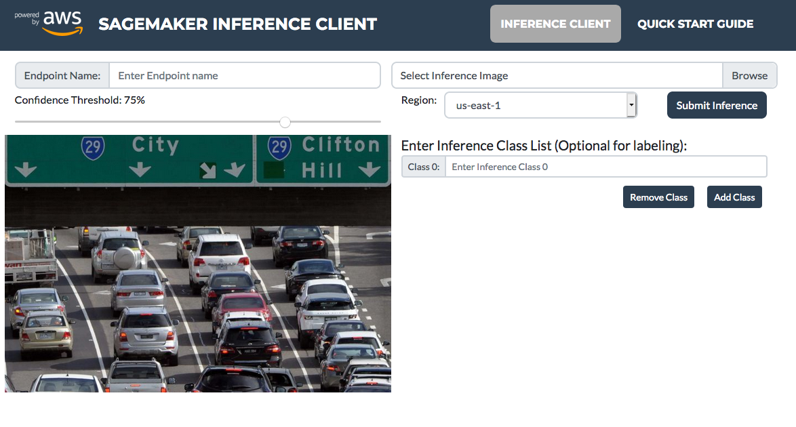

# Amazon Sagemaker Inference Client Application:
This application provides visual bounding boxes and text output of a user provided image submitted against an Amazon Sagemaker object-detection model inference endpoint.

The application consists of a web client that accepts and submits images to an Amazon Sagemaker Object Detection Inference Endpoint (via an Amazon API Gateway and AWS Lambda) and visualizes the bounding box predictions against a configurable confidence threshold. 

The main use is to provide a demo application that integrates with Amazon Sagemaker 
object-detection inference endpoint but has also proven to be a useful tool to quickly visualize and validate when developing and optimising Amazon Sagemaker Object Detection models.

The application consists of a frontend (Native JS Bootstrap4 Web UI) and a backend NodeJS AWS Lambda and Amazon API Gateway. The required hosting and AWS services are best managed and deployed via AWS Amplify although you are free to deploy the source manually or with any other automation engines. A detailed description of deploying with AWS Amplify is provided in the Deployment section below. 
 
## Overview:
The code presented here is intended to be managed and maintained by AWS Amplify which automates the provisioning and deployment of hosting infrastructure for web and mobile applications. This repository consists of a front-end native JS web application, a series of backend services and a public API gateway. 



The folder structure is:

1. /app: The JS Client application that will be hosted in Amazon S3 using the static web hosting functionality via an Amazon CloudFront Distribution,
2. /lambda-function: The source code for the backend AWS Lambda to be deployed.

If following the AWS Amplify Deployment steps below the following directory structure will be automatically created by AWS Amplify and includes:

1. /amplify: configuration and cloud side resources.
    + /backend/api: 
        - Contains the configuration files and AWS CloudFormation template to automate the deployment of an Amazon API Gateway to expose the backend lambda function.
    + /backend/function:
        - The NodeJs Lambda code that through the Amazon API Gateway exposes a public API to the client application to accept requests for the Sagemaker Inference Endpoint.
        - The AWS CloudFormation template to deploy this service.

The flow of a request through this application is:
1. User submits an image in client-side web application,
2. Client-side forwards request to cloud API including the image data and other parameters,
3. Cloud API / Lambda pre-process for validity and format and then forwards the request to Amazon Sagemaker Inference Endpoint using role-based permissions.
4. Sagemaker Inference Endpoint processes the request and returns predictions.

## Download and Deploy with AWS Amplify

#### Clone or Fork and Clone the Repo.

The AWS Amplify config files generated will be unique to your AWS account / environment. Because of this we don't save the Amplify config in this GIT repo, you should **clone** the repo if intending to save the project locally or **fork and clone** the repo if intending on committing and tracking the AWS Amplify config directory in a separate GIT repository. In all but for simple trial or testing the latter is expected to be most likely. 

**(optional) Fork the Source Repository**
Fork this GIT repo from: https://github.com/dcolcott/aws-amplify-sagemaker-inference-client

**Clone the Source or forked Repository**
1. If using source repository:
`git clone git@github.com:dcolcott/aws-amplify-sagemaker-inference-client.git`
`cd aws-amplify-sagemaker-inference-client`

2. if using forked repository:
`git clone git@[your repo]`
`cd [your repo]`

#### Install the Client Side NPM dependencies:
`npm install`

#### Build the Client Side Application:
`npm run build`

#### Initilise AWS Amplify in the branch
`amplify init`

**Responses:**

* Enter a name for the project **awsamplifysagemaker**
* Enter a name for the environment: ***[Enter name for the given env. i.e: master, dev, test, staging, etc.]***
* Choose your default editor: ***[Select your preferred IDE, select none if not listed.]***
* Choose the type of app that you're building: **javascript**
* Please tell us about your project
  * What javascript framework are you using: **none**
  * Source Directory Path: **app**      << **Note:** *This is not the default option, needs to be updated*
  * Distribution Directory Path: **dist**  
  * Build Command:  **npm run-script build**
  * Start Command: **npm run-script start**
Using default provider  awscloudformation

For more information on AWS Profiles, see:
https://docs.aws.amazon.com/cli/latest/userguide/cli-multiple-profiles.html

* Do you want to use an AWS profile? **Yes**
* Please choose the profile you want to use: ***[Choose the profile you want for the desired AWS Account]***

#### Add Amplify S3 / CloudFront public hosting
`amplify add hosting`  

**Responses:**
* Select the environment setup: **PROD (S3 with CloudFront using HTTPS)**
* hosting bucket name: ***[Enter to accept the default or enter a unique value.]***

#### Publish the Client Side Application to AWS public hosting.
`amplify publish`  

**Responses:**

✔ Successfully pulled backend environment dev from the cloud.

Current Environment: [Your Environment]

| Category | Resource name   | Operation | Provider plugin   |
| -------- | --------------- | --------- | ----------------- |
| Hosting  | S3AndCloudFront | Create    | awscloudformation |

* Are you sure you want to continue? **Yes**

#### Create the backend API and serverless function
`amplify add api`  

**Responses:**
**Note:** *Some of the text responses given below are referenced in the source code and so must be copied exactly.*

* Please select from one of the below mentioned services: **REST**
* Provide a friendly name for your resource to be used as a label for this category in the project: **smInferenceClient**
* Provide a path (e.g., /items) **/api/vi/sagemaker/inference**
* Choose a Lambda source: **Create a new Lambda function**
* Provide a friendly name for your resource to be used as a label for this category in the project: **awsamplifysagemaker**
* Provide the AWS Lambda function name: **awsamplifysagemaker**
* Choose the function template that you want to use: **Serverless express function (Integration with Amazon API Gateway)**
* Do you want to access other resources created in this project from your Lambda function? **No**  
* Do you want to edit the local lambda function now? **No**  
Successfully added the Lambda function locally  
* Restrict API access: **No**
* Do you want to add another path? **No**

Successfully added resource smInferenceClient locally

#### Copy lambda code to amplify backend function ```src``` directory
In the previous step, AWS Amplify defined a skeleton Lambda function witgh placeholders for the function handler. The below command overwrites this with the Sagemaker Inference client backend source code.  
`cp -r lambda-function/src/ amplify/backend/function/awsamplifysagemaker/src/`


#### Update Lambda Function Role to Allow Sagemaker InvokeEndpoint Permissions.

AWS Amplify creates an AWS CloudFormatiom template for every object deployed. The Lambda function template is at:
amplify/function/awsamplifysagemaker/awsamplifysagemaker-cloudformation-template.json

In this template just after the **LambdaExecutionRole** object and just above the **lambdaexecutionpolicy** object add the below text:

```
    "lambdasagemakeraccesspolicy": {
      "DependsOn": [
        "LambdaExecutionRole"
      ],
      "Type": "AWS::IAM::Policy",
      "Properties": {
        "PolicyName": "lambda-sagemaker-invoke-endpoint",
        "Roles": [
          {
            "Ref": "LambdaExecutionRole"
          }
        ],
        "PolicyDocument": {
          "Version": "2012-10-17",
          "Statement": [
            {
              "Effect": "Allow",
              "Action": [
                "sagemaker:InvokeEndpoint"
              ],
              "Resource": {
                "Fn::Sub": [
                  "arn:aws:sagemaker:${region}:${account}:endpoint/*",
                  {
                    "region": {
                      "Ref": "AWS::Region"
                    },
                    "account": {
                      "Ref": "AWS::AccountId"
                    }
                  }
                ]
              }
            }
          ]
        }
      }
    },
    ```

This will add a new policy to the Lambda execution role that permits Amazon Sagemaker InvokeEndpoint permissions.

#### Deploy the Project to AWS Cloud:
`amplify push`  

This command can take some time. It will create a S3 bucket with a secure Amazon CloudFront distribution to publicly host the client side. For the backend, AWS Amplify will create and deploy the Lambda and create an Amazon API gateway and configure the required integrations between the them. 

## Bugs and Issues

TBA

## About

TBA

## Copyright and License

TBA


