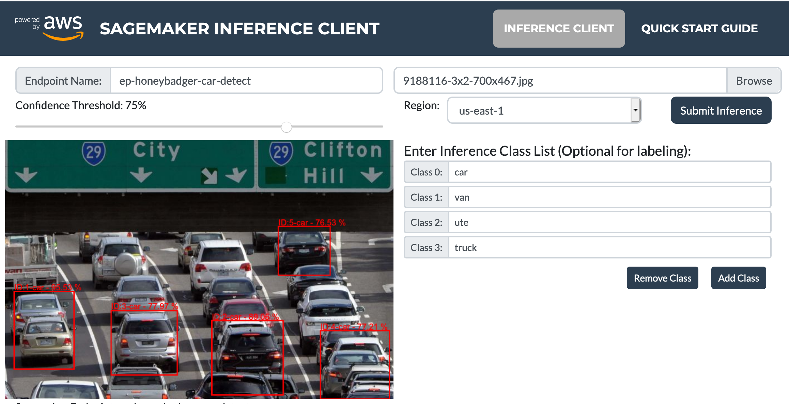
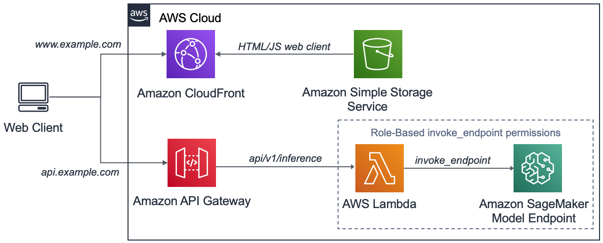

# Amazon Sagemaker Inference Endpoint Client Application.



Amazon SageMaker is a fully managed service that removes the heavy lifting from each step of the machine learning process to make it easier to develop and train high quality machine learning models. This is especially attractive to developers that want to incorporate machine learning outcomes onto their applications without having to build and managed every step of the process.

Once trained, the machine learning model needs to be hosted and exposed in a way that makes it accessible to client applications and M2M services. A common way to do this is via an Amazon Sagemaker Endpoint which is a service optimised to hosts machine learning models and presents an authenticated public interface that can be consumed by end user applications.

The application code presented in this repository consists of a native JavaScript (Bootstrap4) web client and a backend NodeJS AWS Lambda and Amazon API Gateway configuration. This provides an end to end example of how to perform an object detection inference against an Amazon Sagemaker Endpoint. The web client in this example overlays visual bounding boxes and text output of a user provided image submitted against the Amazon SageMaker Endpoint as displayed above.

## AWS Amplify.
In addition to the application stack, AWS Amplify is used to manage a highly opinionated, secure, scalable and cost optimised deployment of the AWS services described. In doing so, further removing the heavy lifting of managing cloud or physical infrastructure from the developer to host the application. Through this process and with just a few commands, we can deploy the full application stack ready to incorporate object detection inference from our web client. See [AWS Amplify](https://docs.amplify.aws/) for more detail.  

## Application Architecture.
The application architecture is shown in the following diagram:


While provided as a code example, this application has also proven to be a useful tool to quickly visualize and validate when developing and optimising Amazon Sagemaker object detection models. Being able to see the result of your object detection model in a simulation of a real client application tends to be motivating and encourages the developer to press on with the work of experimenting with machine learning model development.

## AWS Lambda role based permissions.
Amazon Sagemaker Endpoints present an authenticated interface to the Internet so it’s reasonable to ask why we need to route the inference request via the Amazon API Gateway and the AWS Lambda. The reason in this example is so we can use AWS IAM role-based permissions to allow the Lambda to invoke the Sagemaker Endpoint without the need for the end-user to authenticate themselves in the web client. In this case, an unauthenticated request is received by the Lambda which by virtue of the sagemaker:invokeEndpoint role-based permission is able to forward the request to the Sagemaker Endpoint. This architecture should be considered for secure environments. 

## Hosting an object detection model.
The intent of this exercise is not to cover the building and training of an Amazon Sagemaker object detection model. There are plenty of great resources already covering this such as [Object Detection using the Image and JSON format](https://github.com/awslabs/amazon-sagemaker-examples/blob/master/introduction_to_amazon_algorithms/object_detection_pascalvoc_coco/object_detection_image_json_format.ipynb)

If you don't have a model and just want to get started, we have provided an object detection model for download at **TBA**. This model has been trained to detect the rear of cars and other vehicles and is what we will be using in this example. To deploy it follow the instructions at: **TBA**

## Deploying the application.
Deploying the application stack described using AWS Amplify is just a few simple commands but does assume you have access to an AWS environment. You are free to deploy in any AWS region supporting all of the listed services but when first creating the hosting resources it can take a few of hours for DNS to propagate and your application to become available if not deployed in the **US-EAST-1** region. For this reason, we will deploy in **US-EAST-1** and encourage you to do the same.

The following procedure assumes you are on a supported Linux or MacOS device and have installed:
1. Node: v10.16.x or greater
1. NPM: v6.13.x or greater
1. Git: v2.23.0 or greater

**Note:** If not already configured, you will need to create the AWS CLI credentials and configuration file to allow CLI and programmatic access. Follow the procedure [here](https://docs.aws.amazon.com/cli/latest/userguide/cli-chap-configure.html) if required. Be sure to specify the region you intend to use in during the process.

#### To deploy the application stack, follow the below steps.

**1. Clone this repository and 'cd' into the directory:**  
```
git clone git@github.com:dcolcott/aws-amplify-sagemaker-inference-client.git`
cd aws-amplify-sagemaker-inference-client
```

**2. Install the application dependencies and build the project:**  
```
npm install
npm run build
```

**3. Install AWS Amplify CLI:**   
```
npm install -g @aws-amplify/cli@4.18.1
```

**4. Initialize AWS Amplify in this project:**  
```
amplify init
```

Enter the following responses:  
* Enter a name for the project **awsamplifysagemaker**
* Enter a name for the environment: **dev**
* Choose your default editor: ***[Select your preferred IDE, select none if not listed.]***
* Choose the type of app that you're building: **javascript**
* Please tell us about your project
  * What javascript framework are you using: **none**
  * Source Directory Path: **app**      << **Note:** *This is not the default option, needs to be updated*
  * Distribution Directory Path: **dist**  
  * Build Command:  **npm run-script build**
  * Start Command: **npm run-script start**
Using default provider  awscloudformation

For more information on AWS Profiles, see:
https://docs.aws.amazon.com/cli/latest/userguide/cli-multiple-profiles.html

* Do you want to use an AWS profile? **Yes**
* Please choose the profile you want to use: ***[Choose the profile you want for the desired AWS Account]***

**5. Using AWS Amplify, add S3 backed CloudFront public hosting:**  
```
amplify add hosting
```

Enter the following responses: 
* Select the plugin module to execute **Amazon CloudFront and S3**
* Select the environment setup: **PROD (S3 with CloudFront using HTTPS)**
* hosting bucket name: ***[Enter to accept the default or enter a unique value.]***

**6. Using AWS Amplify, create the backend API Gateway and serverless function:**  
```
amplify add api
```
Enter the following responses:  
**Note:** *Some of the text responses given below are referenced in the source code and so must be copied exactly.*

* Please select from one of the below mentioned services: **REST**
* Provide a friendly name for your resource to be used as a label for this category in the project: **smInferenceClient**
* Provide a path (e.g., /items) **/api/v1/sagemaker/inference**
* Choose a Lambda source: **Create a new Lambda function**
* Provide a friendly name for your resource to be used as a label for this category in the project: **awsamplifysagemaker**
* Provide the AWS Lambda function name: **awsamplifysagemaker**
* Choose the function runtime that you want to use: **NodeJS**
* Choose the function template that you want to use: **Serverless express function (Integration with Amazon API Gateway)**
* Do you want to access other resources created in this project from your Lambda function? **No**  
* Do you want to invoke this function on a recurring schedule" **No**
* Do you want to edit the local lambda function now? **No**  
Successfully added the Lambda function locally  
* Restrict API access: **No**
* Do you want to add another path? **No**

Successfully added resource smInferenceClient locally.

**7. Copy the AWS Lambda code to local AWS Amplify backend function:**  
In the previous step, AWS Amplify defined a skeleton Lambda function with placeholders for the function handler. The below command overwrites this with the Sagemaker Inference client backend source code developed for this project: 
```
cp -r lambda-function/src/ amplify/backend/function/awsamplifysagemaker/src/
```

**8. Update AWS Amplify generated Lambda role-based policy to add InvokeEndpoint:**  
In the previous step, AWS Amplify created an AWS CloudFormation template to deploy the AWS Lambda function including the role-based permissions. The below command overwrites this template to also include an additional policy to give the Lambda sagemaker:InvokeEndpoint permissions. 
```
cp awsamplifysagemaker-cloudformation-template.json amplify/backend/function/awsamplifysagemaker/awsamplifysagemaker-cloudformation-template.json
```

**9. Push the application stack and publish the client-side code:**  

The above commands configured the automation scripts to deploy an optimised hosting stack but AWS Amplify only saved these locally in the **amplify** directory that was created with the ```amplify init``` command.

This concept of local and remote configuration is key to AWS Amplify. You can see the current status of the configured service as below:
```
amplify status
```

AWS Amplify has two commands to push the local config:
1. **amplify push:** Will push the automation scripts for any services that are not in sync.
2. **amplify publish:** Will perform an **amplify push** then also upload the content of the **dist** folder.

In this case because we want to create the environment and also upload the client application so we will choose to publish:
```
amplify publish
```

Confirm the update when asked:  
? Are you sure you want to continue? (Y/n): **Y**

At the completion of this command you will be given the URL the application is hosted at such as:
```
Your app is published successfully.
https://AAAABBBBCCCC.cloudfront.net
```

Record this URL.

**Note:** This command can take some time. It will create an S3 bucket with a secure CloudFront distribution to publicly host the client side application. For the backend, AWS Amplify will create and deploy the Lambda and create an Amazon API gateway and configure the required integrations between the them. 

## Accessing the Web Application.
On completion of the above sections, the web client will be hosted at an Amazon CloudFront URL that was shown in the previous output. If you missed it just enter `amplify status` and look for the CloudFront distribution URL again.

**Open the Amazon CloudFront URL in a browser and enter into the UI:**  
1. The name of the Amazon SageMaker Endpoint to send the image for inference,
1. The AWS region the Endpoint is hosted,
1. Add the inference labels (these are just for display),
1. Select an image to send for inference and
1. Click ‘Submit Inference’

In our case we are sending the inference against a model trained to detect the rear of cars and other vehicles.  
* The Endpoint name is: **aws-vehicle-detect**,
* The labels trained against were: **‘car’ and ‘van’**,
* The Endpoint is hosted in: **US-EAST-1**

We selected an image consisting of a busy traffic scene we that was found on the Internet (and not in the training image dataset) and got the below result:

**TBA** Add updated image of application in use with car detect model.

As you can see, the client application was able to process the Image and update the response of the Amazon SageMaker Endpoint inference. 

## Conclusion.
**TBA**


## Bugs and Issues.

TBA

## About.

TBA

## Copyright and License.

TBA
